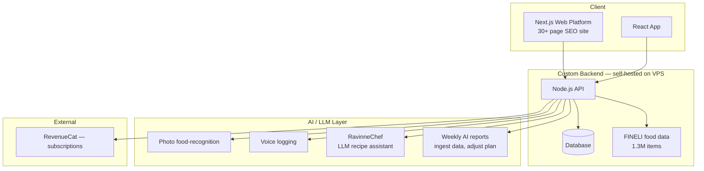

# Ravinne — AI Nutrition App (Case Study)

> An AI nutrition app and web platform I built **solo, end to end**. **4.9★.**

**Live:** [ravinne.fi](https://ravinne.fi/)

> This is a documentation-only case study. The source is private because Ravinne is a live product. This repo shows how it's built and what I own.

---

## The problem
Food logging is tedious, so people quit. Ravinne makes logging fast (photo, voice, barcode) and then does something with the data: it analyses each user weekly and adjusts their plan automatically, instead of leaving them to interpret numbers alone.

## My role
Founder and solo developer. I built the entire product myself: the app, the AI features, the full backend, the payment system, and a 30+ page SEO web platform.

---

## Architecture

---

## Key features I built

**AI food logging**
- **Photo recognition** over the 1.3M-item FINELI database.
- **Voice logging** and **barcode scanning** for fast entry.
- **RavinneChef**, an LLM recipe assistant.

**Weekly AI reports**
The system ingests each user's data, analyses it, and adjusts their nutrition plan automatically. This is an AI making real decisions on production data, not a chatbot bolted on.

**Full custom backend (Node.js on a VPS)**
Self-hosted, with my own RevenueCat payment system.

**Web platform (Next.js / React)**
A 30+ page SEO-optimized site that drives discovery and supports the product.

---

## Stack
`React` · `Next.js` · `TypeScript` · `Node.js` · `LLM/GenAI` · `RevenueCat` · self-hosted VPS backend
