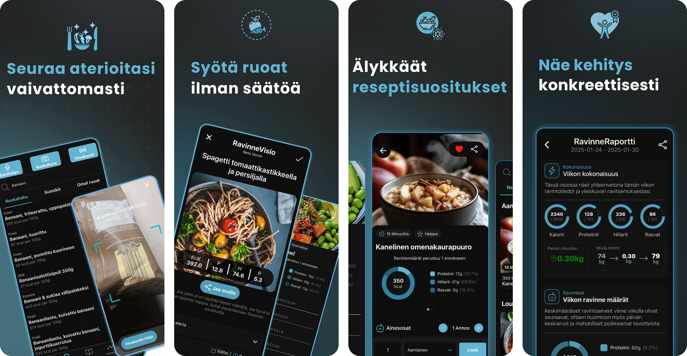

# Ravinne

Ravinne is a calorie and nutrition tracker for Finnish users on iOS and Android. I built it alone: the React Native app, the Node API behind it, the widgets and watch apps, and the website. It has been on the App Store since 13 November 2025, where it holds 4.4 out of 5 from 16 ratings in Finland, and it has passed 500 downloads on Google Play. All 284 commits in the app repository and all 39 in the website repository are mine.

It is on the [App Store](https://apps.apple.com/fi/app/ravinne-kalorilaskuri/id6744070817) and [Google Play](https://play.google.com/store/apps/details?id=com.kende6644.StickerSmash), and the website is [ravinne.fi](https://ravinne.fi). The code is private because Ravinne is a live commercial product, so this repository is documentation only. I can walk through any part of the code on a call.

Written by Kenneth Minkinen. I'm half Estonian, half Finnish, and an EU citizen relocating to Tallinn. You can reach me on [LinkedIn](https://www.linkedin.com/in/kenneth-minkinen-118643281/).

<picture>
  <source media="(max-width: 600px)" srcset="https://github.com/KennethMin/ravinne-case-study/raw/HEAD/assets/ravinne-grid.png">
  
</picture>

App Store screenshots, in Finnish: search and scan, a meal read from a photo, a recipe, the weekly report.

## What it does

You log what you eat and Ravinne tracks energy, protein, carbohydrate and fat against a daily target. Food goes in by search, barcode, a spoken sentence or a photo of the plate. The food data is built for Finland: 38,796 foods ship inside the app, 37,377 of them with a barcode, mostly products sold in Finnish shops. Around that sit recipes, a fasting timer, water and weight tracking, and Apple Health and Health Connect integration.

Once a week the app re-estimates how much energy the user actually burns and proposes a new calorie target. The user decides whether to take it.

The app is free to download and the barcode scanner is free. Photo recognition and the other AI features are part of a subscription, which runs on RevenueCat. The interface is in Finnish; an English locale exists but covers only 153 keys so far.

## My role

I am the only developer. I own the app and its native targets, the API and the server it runs on, payments, the admin dashboard, the store releases and the website. The App Store lists me as the seller. The app repository has commits on 94 different days since 6 September 2025, when its current history starts.

## How it is built

- The app runs on Expo SDK 57, React Native 0.86 and React 19.2 with Expo Router: 88 files under `app/` and 265 under `components/`. It is a JavaScript codebase: 922 code files are JS or JSX and 8 are TypeScript, mostly bindings for local Expo modules.
- The API is Node.js on Express 5, with 223 route handlers across 14 router files and `server.js`, and 30 Mongoose models on MongoDB. Redis and BullMQ carry the push-notification and email queues, and node-cron runs the schedulers.
- The API runs on a self-hosted Ubuntu VPS behind nginx, managed with pm2. It opens the 38,796-food SQLite database read-only (better-sqlite3) to match AI output to real foods. The same database ships inside the app, so barcode lookups work without a network.
- Native code is 14,205 lines of Swift and Kotlin in 33 files. On iOS there are 9 widgets (6 home screen, 3 lock screen), a Control Center control and 2 Live Activities for fasting and cooking, plus a SwiftUI watchOS app with complications. On Android there are 6 home-screen widgets and a Kotlin Wear OS app with 3 Tiles. Five local Expo modules in Swift and Kotlin bridge the native side to JavaScript.
- Gemini and OpenAI models handle photo recognition, voice logging, recipe generation and the weekly report text. RevenueCat sends subscription events to a webhook on the API. Sentry and PostHog run in both the app and the API.
- An admin dashboard in plain JavaScript is served by the API at `/dashboard`, behind JWT and an admin check.

Size on the main branch: 393,102 physical lines in 983 code files. Leaving out comments, blank lines and the `docs/`, `oldscraper/`, `public/` and `checkpoints/` folders, about 260,600 lines are code.

| Area | Physical lines |
|---|---:|
| App: screens, components, state, hooks, widgets | 207,218 |
| Services shared by the app and the API | 35,759 |
| API: server, routes, models, middleware, notifications | 30,648 |
| Swift and Kotlin | 14,205 |
| Tests | 71,127 |
| Build and data scripts | 16,993 |

## Engineering notes

### Photo recognition returns database rows

A vision model will give a confident calorie count for a plate of pasta whether or not it is right. So in Ravinne a resolver (`foodResolver.js`) swaps the nutrition values the model recalled for a real row from the food database, plus a curated household portion such as "80 g, 1 pala". A weak match is only offered as an alternative, and the model's values stay.

The request falls back from Gemini 3.5 Flash-Lite to Gemini 3.1 Flash-Lite to gpt-5-mini, each with its own deadline and a forced response schema. I chose the primary model from a benchmark (n=20) where its median response took 1.33 s against 8.6 s for gpt-5-mini.

### Voice logging in Finnish

Speech goes to gpt-4o-transcribe with a prompt of Finnish food vocabulary. I switched from whisper-1 after comparing word error rates: 42.4% against 63.6%. A Gemini Flash-Lite model then turns the transcript into structured items, and the same resolver matches each one to the food database.

### The calorie target comes from arithmetic

The weekly target is set by deterministic code on the device (`algorithmSlice.js`, 2,350 lines), and no language model touches it. It back-calculates what the user burned from logged intake against the weight trend at 7,700 kcal per kg, weights recent weeks 50/30/20 and moves the target by at most 200 kcal a week. It also handles plateaus and reverse-diet phases, and it never goes below sex-specific calorie floors, which the API checks again.

A Gemini model writes the report text only. That text has to pass a Finnish lexicon of 20+ patterns that blocks diagnosis-like and eating-disorder-adjacent wording. The support chat uses the same check, and a match there hands the conversation to a person.

### Micronutrients from national open data

Shop products in the database carry the values from their nutrition labels, and labels rarely list vitamins or minerals. Fineli, the national food-composition database from THL (CC BY 4.0), has measured values for 4,238 generic foods. An LLM proposes which Fineli food a messy product name refers to, and a macro gate keeps the link only if energy, protein, fat and carbohydrate agree. That produced 13,593 product links, each inheriting 13 micronutrients.

Products that could not be linked get an estimate instead. A model names candidate Fineli ingredients, and an exact solver fits their proportions so the mix reproduces the 8 values on the manufacturer's label (the EU 1169/2011 set). I checked accuracy by withholding the true food from the candidate list. The database holds 16,103 of these estimates. The links and the estimates are on main and have not been released yet.

### Barcode scans answered offline

The scanner uses the code scanner in react-native-vision-camera. A barcode is looked up in the user's own foods first, then in the SQLite database bundled in the app, and only then on the API, which searches an Open Food Facts mirror in MongoDB. A hit in the bundled database comes back in under 300 ms, before any network call.

### Finnish search on MongoDB

Finnish inflects nouns, so a user who types "kauraa" (the partitive of "kaura", oats) expects oat products. MongoDB has no Finnish text analyser, so the search expands the query to cover inflected forms and leaves the stored documents as they are. For "kauraa", results went from 0 to 89.

### Watch apps and widgets in an Expo project

Expo prebuild generates the Android project but cannot add a Wear OS module to it. I wrote a config plugin (`withWearOsModule.js`) and a sync script that add the Kotlin Wear app (4,048 lines, 3 Tiles and a complication) to the generated project, and a local Expo module that sends data to the watch through the Wearable Data Layer. On iOS, another local module connects the phone to the watchOS app over WatchConnectivity, and 3 AppIntents let the widgets add or remove water and log a meal without opening the app.

## The website

[ravinne.fi](https://ravinne.fi) is a Next.js 16 site in TypeScript that I built for search traffic. It has 17 calculators that run in the browser and 67 articles with source lists, about 113,000 words in MDX; the live sitemap lists 97 URLs. Typed helpers in `lib/seo.ts` generate JSON-LD (FAQPage, HowTo, MedicalWebPage, BreadcrumbList and others) used in 51 files, and a post-build script checks internal links. Pages are prerendered, and the site runs behind nginx on a self-hosted server. It also holds a 6-page admin panel for users, recipes, chat and settings.

## Where it stands

Both stores run a build from 10 March 2026 (version 1.30 on the App Store). The SDK 57 rebuild, the Fineli micronutrients and most of the model benchmarking landed on main after that and have not shipped yet. The test suite is new as well: 213 Jest test files with about 5,030 test cases (counted with grep), all added since 9 August 2026.

Code figures on this page are from main on 25 September 2026. Store figures are from the listings on 26 September 2026.

## Tools by layer

| Layer | Tools |
|---|---|
| App | JavaScript, Expo SDK 57, React Native 0.86, React 19.2, Expo Router, i18next, react-native-vision-camera, Jest with jest-expo and Testing Library |
| Native | Swift (widgets, ActivityKit, AppIntents, SwiftUI on watchOS), Kotlin (Wear OS Tiles, Data Layer), react-native-android-widget, HealthKit, Health Connect |
| API | Node.js, Express 5, MongoDB with Mongoose 9, Redis with BullMQ, node-cron, better-sqlite3, Socket.IO, helmet, nodemailer |
| Hosting | Self-hosted Ubuntu VPS, nginx, pm2 |
| Services | Gemini, OpenAI, RevenueCat, Sentry, PostHog |
| Website | TypeScript, Next.js 16 (App Router), Tailwind CSS 4, Velite (MDX), Recharts, Resend |

Tsemppi, the workout app I co-founded and lead development on, has its own write-up in [tsemppi-case-study](https://github.com/KennethMin/tsemppi-case-study).
